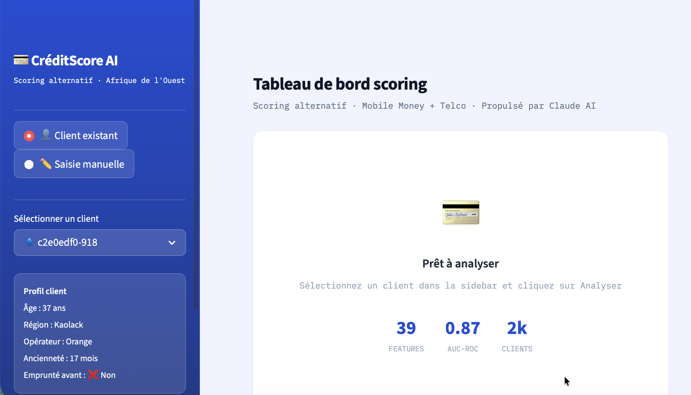
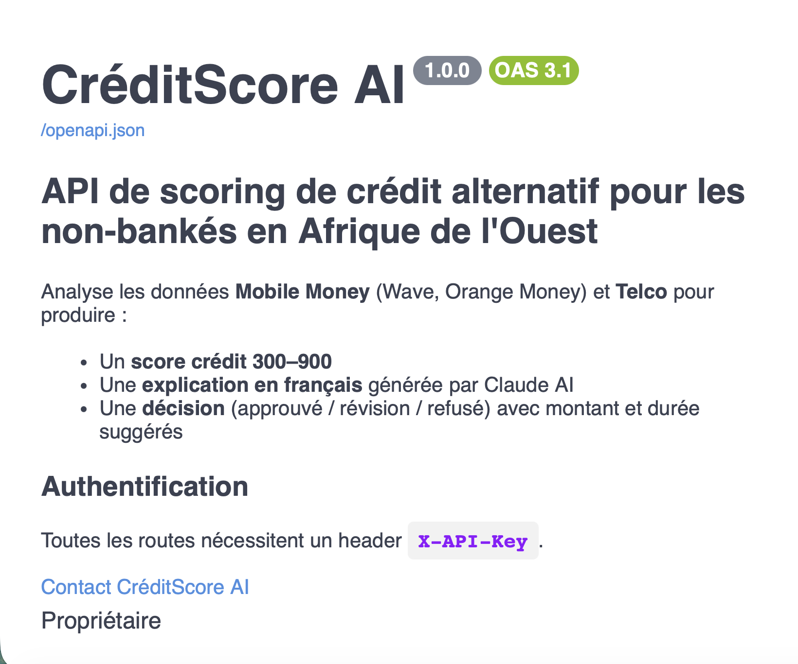

# CréditScore AI

> Scoring de crédit alternatif pour les **non-bankés en Afrique de l'Ouest**  
> Analyse les données **Mobile Money** (Wave, Orange Money) et **Telco** pour évaluer la solvabilité sans historique bancaire.

    

---

## Aperçu

| Dashboard | API Swagger |
|:---------:|:-----------:|
|  |  |

---

## Comment ça marche

```
Données Mobile Money + Telco
        ↓
Feature Engineering  →  39 features (RFM, fenêtres temporelles, scores télécom)
        ↓
XGBoost calibré  →  Score 300–900 + probabilité
        ↓
SHAP TreeExplainer  →  Top 5 facteurs déterminants
        ↓
Agent LangGraph (4 nœuds)  →  Explication en français via Claude Haiku
        ↓
Décision : APPROUVÉ / RÉVISION MANUELLE / REFUSÉ
```

### Seuils de décision

| Score | Risque | Décision | Montant max | Durée max |
|-------|--------|----------|-------------|-----------|
| ≥ 700 | 🟢 Faible | APPROUVÉ | 500 000 XOF | 12 mois |
| 550–699 | 🟡 Modéré | RÉVISION MANUELLE | 200 000 XOF | 6 mois |
| 400–549 | 🟠 Élevé | RÉVISION MANUELLE | 75 000 XOF | 3 mois |
| < 400 | 🔴 Très élevé | REFUSÉ | — | — |

---

## Performance du modèle

| Métrique | Valeur |
|----------|--------|
| AUC-ROC (test) | **0.860** |
| AUC-ROC (CV 5-fold) | **0.873 ± 0.018** |
| Brier Score | 0.151 |
| Précision (vrais positifs) | 159 / (159 + 38) = 80.7 % |

---

## Stack technique

| Composant | Technologie |
|-----------|-------------|
| Modèle ML | XGBoost + CalibratedClassifierCV |
| Explicabilité | SHAP (TreeExplainer) |
| Agent IA | LangGraph + LangChain |
| LLM | Claude Haiku via OpenRouter |
| API | FastAPI + Pydantic v2 |
| Dashboard | Streamlit |
| Runtime | Python 3.11 · uv |

---

## Installation

```bash
git clone https://github.com/SeydinaBANE/credit-scoring.git
cd credit-scoring

# Installer les dépendances
uv sync

# Configurer l'environnement
cp .env_exemple .env
# → Éditer .env et ajouter OPENROUTER_API_KEY
```

### Variables d'environnement (`.env`)

| Variable | Description | Défaut |
|----------|-------------|--------|
| `OPENROUTER_API_KEY` | Clé API OpenRouter (obligatoire) | — |
| `OPENROUTER_BASE_URL` | Base URL OpenRouter | `https://openrouter.ai/api/v1` |
| `MODEL_ID` | Modèle LLM | `anthropic/claude-haiku` |
| `API_KEY_DEV` | Clé API dev FastAPI | `cs-dev-key-123` |
| `API_KEY_PROD` | Clé API prod FastAPI | `cs-prod-key-456` |

---

## Lancement

### Avec Docker (recommandé)

```bash
# Configurer l'environnement
cp .env_exemple .env
# → Éditer .env et ajouter OPENROUTER_API_KEY

# Démarrer l'API + le dashboard
docker compose up --build
```

| Service | URL |
|---------|-----|
| API REST | http://localhost:8000 |
| Swagger docs | http://localhost:8000/docs |
| Dashboard | http://localhost:8501 |

### Sans Docker (développement local)

```bash
# Dashboard interactif
uv run streamlit run src/dashboard/app.py

# API REST (docs → http://localhost:8000/docs)
uv run uvicorn src.api.main:app --reload --port 8000
```

---

## API

Toutes les routes nécessitent le header `X-API-Key`.

### Endpoints

| Méthode | Route | Description |
|---------|-------|-------------|
| `GET` | `/health` | État du service |
| `POST` | `/v1/score` | Scorer un client |
| `POST` | `/v1/score/batch` | Scorer jusqu'à 50 clients |
| `GET` | `/v1/model/info` | Métriques et features du modèle |
| `GET` | `/docs` | Documentation Swagger |

### Exemple

```bash
curl -X POST http://localhost:8000/v1/score \
  -H "X-API-Key: cs-dev-key-123" \
  -H "Content-Type: application/json" \
  -d '{
    "mobile_money": {
      "nb_transactions_total": 45,
      "montant_moyen_xof": 12000,
      "regularite_mensuelle": 0.75,
      "nb_tx_30j": 8,
      "nb_tx_90j": 22,
      "recence_jours": 3
    },
    "telco": {
      "nb_recharges_6m": 18,
      "regularite_recharge": 0.80,
      "jours_actif_30j": 24,
      "a_internet_mobile": 1,
      "montant_moy_recharge": 2000
    },
    "profil": {
      "age": 34,
      "anciennete_mois": 24,
      "region": "Dakar",
      "operateur": "Wave"
    }
  }'
```

**Réponse :**
```json
{
  "score": 724,
  "risk_level": "faible",
  "decision": "APPROUVÉ",
  "montant_max_xof": 500000,
  "duree_max_mois": 12,
  "explanation": "Le client présente un profil solide avec une activité Mobile Money régulière...",
  "recommendation": "Prêt recommandé sous conditions standard.",
  "shap_factors": { "regularite_mensuelle": 0.18, "nb_tx_90j": 0.14, "..." : "..." }
}
```

---

## Régénérer les données et le modèle

```bash
# (Optionnel) Générer de nouvelles données synthétiques
uv run python data/generate_data.py

# Recalculer les 39 features
uv run python src/features/feature_engeneering.py

# Réentraîner XGBoost
uv run python src/model/train.py

# Tester l'agent directement (2 clients exemples)
uv run python src/agent/scoring_agent.py
```

---

## Structure du projet

```
credit-scoring/
├── src/
│   ├── config.py                   # Seuils et mappings partagés
│   ├── agent/scoring_agent.py      # Pipeline LangGraph 4 nœuds
│   ├── api/main.py                 # API FastAPI
│   ├── dashboard/app.py            # Interface Streamlit
│   ├── features/feature_engeneering.py  # Feature engineering (39 features)
│   └── model/train.py              # Entraînement XGBoost + SHAP
├── data/
│   ├── generate_data.py            # Générateur synthétique (2 000 clients)
│   ├── clients.csv / transactions.csv / telco.csv
│   ├── features.csv                # Features pré-calculées
│   └── labels.csv
├── models/                         # Artifacts ML (xgboost_model.pkl, shap_explainer.pkl…)
├── .env_exemple                    # Template de configuration
├── Dockerfile                      # Build multi-stage (uv + python:3.11-slim)
├── docker-compose.yml              # Services api + dashboard
└── pyproject.toml
```

---

## Contexte

Ce projet cible les institutions de microfinance et fintechs actives en Afrique de l'Ouest. En l'absence d'historique bancaire, le modèle exploite des signaux comportementaux Mobile Money et télécom comme proxies de fiabilité financière — permettant d'évaluer des millions de clients aujourd'hui exclus du crédit formel.
